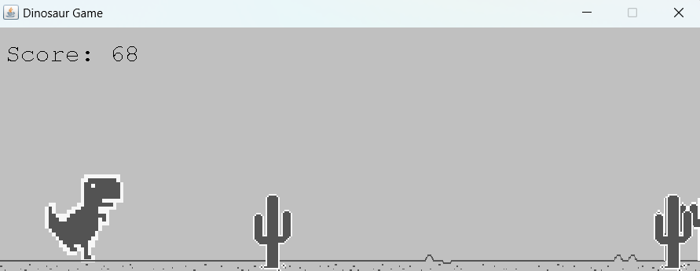
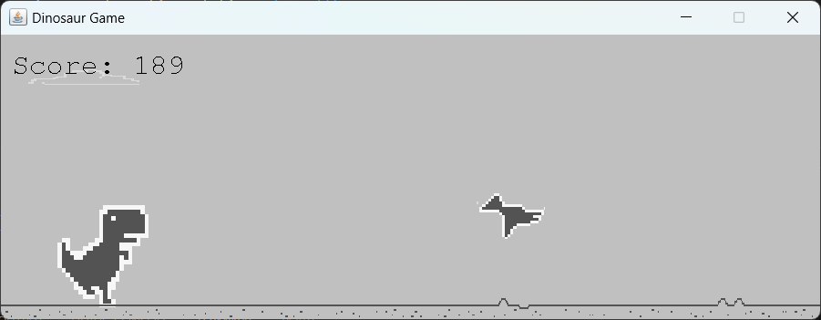
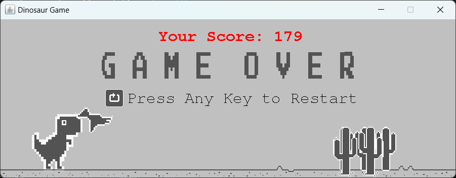

# Chrome Dinosaur Game Clone

A clone of the Chrome Dinosaur game implemented using Java Swing and Abstract Window Toolkit (AWT).

> Try the game using jar file `out\artifacts\Dinosaur Game.jar`

## Screenshots

1. Game Started

2. Bird and Cloud

3. Game Over

## How To Play

1. Press `Spacebar` Key to hop over **cactus**
2. Press `Down` Key to avoid **birds**
3. Press **Any Key** to **restart** the game

## Tech Stack

**Language:** Java